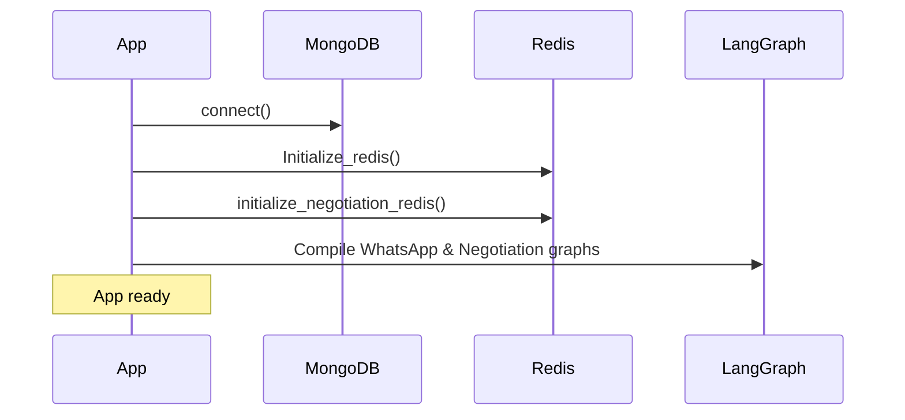
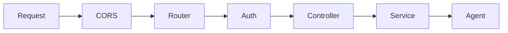
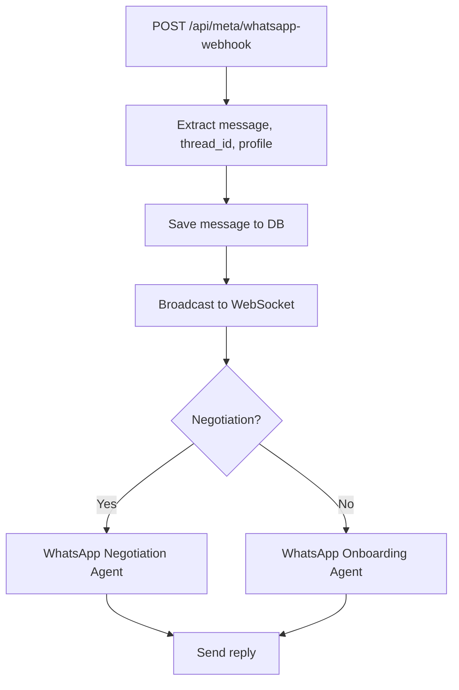
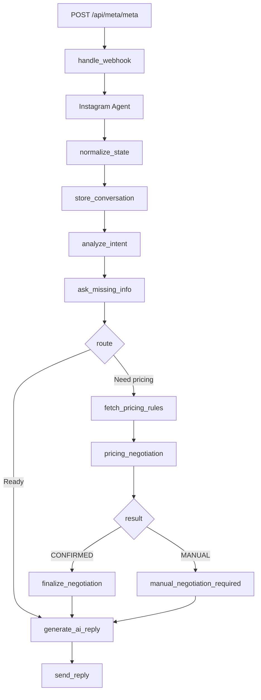
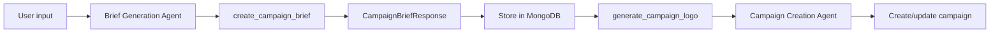
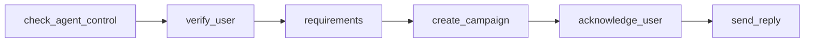
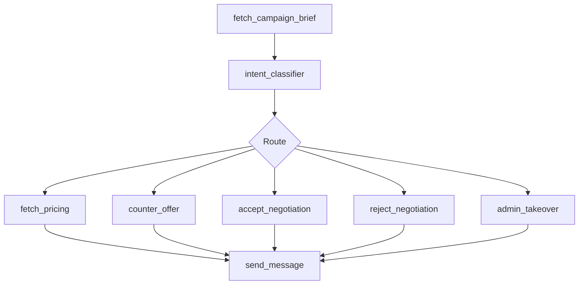

# iShout Backend

API backend for finding and managing social media influencers across WhatsApp and Instagram. Powers AI-driven onboarding, negotiation, campaign creation, and brief generation.

---

## AI Agents

| Agent | Purpose |
|-------|---------|
| **WhatsApp Onboarding** | Onboard influencers via WhatsApp – verify user, collect requirements, create campaign |
| **WhatsApp Negotiation** | Negotiate with influencers on WhatsApp – intent classification, pricing, counter-offer, accept/reject |
| **Instagram** | Handle Instagram DMs – pricing rules, negotiation, AI replies |
| **Campaign Creation** | Create campaigns from user input – store briefs, generate logos |
| **Brief Generation** | Generate structured campaign briefs from natural language prompts |

---

## Meta Integration

- **WhatsApp** – Webhooks at `/api/meta/whatsapp-webhook` for incoming messages
- **Instagram** – Webhooks at `/api/meta/meta` for DMs and conversations

---

## Tech Stack

| Category | Technology |
|----------|------------|
| **Framework** | FastAPI, Uvicorn |
| **Database** | MongoDB (Motor async + PyMongo) |
| **Cache / Session** | Redis (LangGraph checkpointing) |
| **AI / LLM** | OpenAI, LangChain, LangGraph |
| **Auth** | JWT (PyJWT), passlib bcrypt |
| **Email** | Resend |
| **Observability** | Langfuse |
| **Deployment** | Docker, nginx, GitHub Actions → EC2 |

---

## Application Flow

### Startup Flow



1. **Connect to MongoDB** – Database connection established
2. **Initialize Redis** – Session storage for LangGraph checkpoints (WhatsApp, Negotiation)
3. **Compile LangGraph agents** – WhatsApp onboarding, WhatsApp negotiation graphs ready

### Request Flow



- **Request** → CORS Middleware → FastAPI Router → **Auth Middleware (JWT)** → Controller → Service/Agent
- Auth roles: `admin`, `company` (via `require_admin_access`, `require_company_user_access`, `require_company_or_admin_access`)

### WhatsApp Webhook Flow



1. Meta sends webhook → `handle_whatsapp_events`
2. Extract message, thread_id, profile
3. Save message to MongoDB
4. Broadcast to Admin WebSocket
5. If negotiation thread → **WhatsApp Negotiation Agent**; else → **WhatsApp Onboarding Agent**
6. Agent sends reply

### Instagram Webhook Flow



### Campaign & Brief Generation Flow



### WhatsApp Onboarding Graph



### WhatsApp Negotiation Graph



---

## Project Structure

```
ishout-backend/
├── main.py                     # App entry point, lifespan
├── requirements.txt
├── docker-compose.yml
│
├── app/
│   ├── api/
│   │   ├── api.py              # Router aggregation
│   │   ├── routes/             # auth, company, admin, meta, ws
│   │   └── controllers/
│   │
│   ├── agents/                 # AI agents
│   │   ├── Whatsapp/           # WhatsApp Onboarding Agent
│   │   ├── WhatsappNegotiation/# WhatsApp Negotiation Agent
│   │   ├── Instagram/          # Instagram Agent (DMs, pricing)
│   │   ├── campaiagncreation/  # Campaign Creation & Brief Generation
│   │   └── flow/
│   │
│   ├── core/                   # Redis, errors, security
│   ├── db/                     # MongoDB connection
│   ├── Guardails/              # Input/output guardrails
│   ├── middleware/             # Auth middleware (JWT)
│   ├── model/                  # Data models
│   ├── Schemas/                # Pydantic schemas
│   ├── services/               # Meta (WhatsApp, IG), email, etc.
│   └── tools/                  # Influencer search tools
│
├── nginx/
└── .github/workflows/
```

---

## API Overview

| Prefix | Description |
|--------|-------------|
| `/api/auth` | Register, login, forgot-password, verify-email |
| `/api/company` | Campaigns, briefs, influencer search, messaging |
| `/api/admin` | Campaign management, users, WhatsApp/IG sessions, negotiations |
| `/api/meta` | Meta integration – WhatsApp webhook, Instagram webhook |
| `/api/ws` | Admin WebSocket notifications |

---

## Quick Start

See [setup-guide.txt](setup-guide.txt) for full instructions.

**Mac / Linux**

```bash
python3 -m venv .venv
source .venv/bin/activate
pip install -r requirements.txt
uvicorn main:app --reload
```

**Windows**

```powershell
py -m venv .venv
.\.venv\Scripts\Activate.ps1
pip install -r requirements.txt
uvicorn main:app --reload
```

Configure `.env` with MongoDB, Redis, Meta tokens, OpenAI key, and other required variables.
